# Getting your R-Pi Ready
1. Get a [R-Pi 4](https://www.raspberrypi.org/products/raspberry-pi-4-model-b/)
2. Get a Samsung Evo Plus 32Gb card
3. Download [_Raspbian Buster Lite_](https://www.raspberrypi.org/downloads/raspbian/) - we will keep it light by installing only what we need and since this is a headless setup anyways we dont need raspbian with desktop.

## Write image to SD Card "without any external software"
1. No need to use _Rufus_, _balenaEtcher_ etc. We will use the inbuilt _**Disks**_ app in Ubuntu.
2. Insert the SD Card, open *Disks*, click on your SD Card on the left.
3. Goto the 3 lines on top right and select *Restore Image*. 
4. From the window select your extracted raspberry buster lite image and be patient. The writing process looks like the following -  
    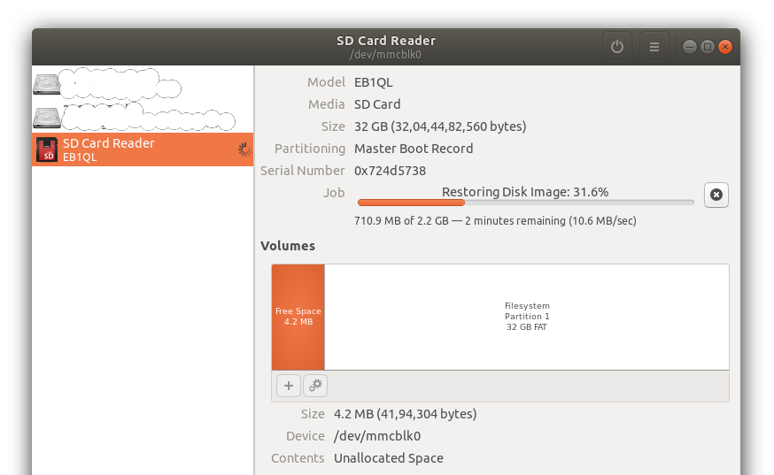

5. Once its done you should see, `boot` and `rootfs` in your Nautilus Sidebar -  
    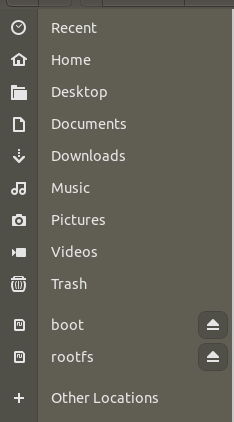

# Headless Setup with WiFi
## Make R-Pi connect to WiFi on boot so that we may SSH to it
There is a great documentation by the R-Pi team itself on this. [Read](https://www.raspberrypi.org/documentation/configuration/wireless/headless.md) that or follow along -
0. Let the SD Card be in your PC.
1. Goto `boot` partition
2. In root directory create a file named `wpa_supplicant.conf`.
When you boot, this file would be automatically moved to `/etc/wpa_supplicant/` directory and Raspbian would use the settings in it to start up wireless networking
3. Copy the following code to the file you just created, making sure to enter your ISO 3166 alpha-2 country code, WiFi network name(SSID) and WiFi password -
    - Get your country code [here](https://www.iso.org/obp/ui), select `Country Code` and press `Search` and look for your country's code.
        ```bash
        ctrl_interface=DIR=/var/run/wpa_supplicant GROUP=netdev
        update_config=1
        country=<YOUR TWO LETTER COUNTRY CODE>

        network={
            ssid="<YOUR NETWORK NAME>"
            psk="<YOUR NETWORK PASSWORD>"
            key_mgmt=WPA-PSK
        }
        ```
## Enable SSH
In the `boot` partition, simply create an empty file with the name `ssh`

## Boot
Plug the SD Card to your R-Pi and power it ON

## SSH to your R-Pi
We now need to find the IP Address of our R-Pi. 
* The easiest method is to find it from the DHCP Table of your WiFi router. Note the IP Address of R-Pi.  Mine looks as follows -
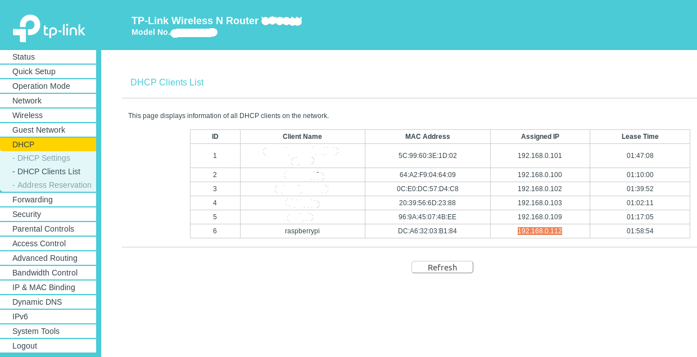

* If you cannot access the DHCP Table then -
    - Use `nmap`
    - Follow the [official docs](https://www.raspberrypi.org/documentation/remote-access/ip-address.md) for `nmap` and a few other methods too

* The easiest method is to not find the IP Address and just use `raspberrypi.local`. Follow along for how to use that.


# First Steps after booting
You can read on how to SSH to remote [here](https://www.digitalocean.com/community/tutorials/how-to-use-ssh-to-connect-to-a-remote-server-in-ubuntu#basic-syntax) or just follow along -

**Don't forget to replace the IP Addresses here with the IP Address of YOUR R-Pi**.  

For the first time the SSH login *username* is **pi** and the *password* is **raspberry**  

Enter `ssh pi@<your Pi's IP address>` and provide *raspberry* when asked for password
```console
$ ssh pi@192.168.0.112
pi@192.168.0.112's password: 
Linux raspberrypi 4.19.75-v7l+ #1270 SMP Tue Sep 24 18:51:41 BST 2019 armv7l

The programs included with the Debian GNU/Linux system are free software;
the exact distribution terms for each program are described in the
individual files in /usr/share/doc/*/copyright.

Debian GNU/Linux comes with ABSOLUTELY NO WARRANTY, to the extent
permitted by applicable law.

SSH is enabled and the default password for the 'pi' user has not been changed.
This is a security risk - please login as the 'pi' user and type 'passwd' to set a new password.
```
## How to do it without IP Address
Login using `ssh pi@raspberrypi.local`
The guide below will use the exact IP Address, however note that you could just replace the IP Address with `raspberrypi.local`. So go ahead and use that freely.

## Change Password
As mentioned in the prompt after you enter the password, lets change the password -
```console
pi@raspberrypi:~ $ passwd
Changing password for pi.
Current password: 
New password: 
Retype new password: 
passwd: password updated successfully
```
## Configure your Pi
Let's configure our R-Pi using `raspi-config`. Read about the various options from the [official documentation](https://www.raspberrypi.org/documentation/configuration/raspi-config.md) and make changes that suits you.
```console
pi@raspberrypi:~ $ sudo raspi-config
```
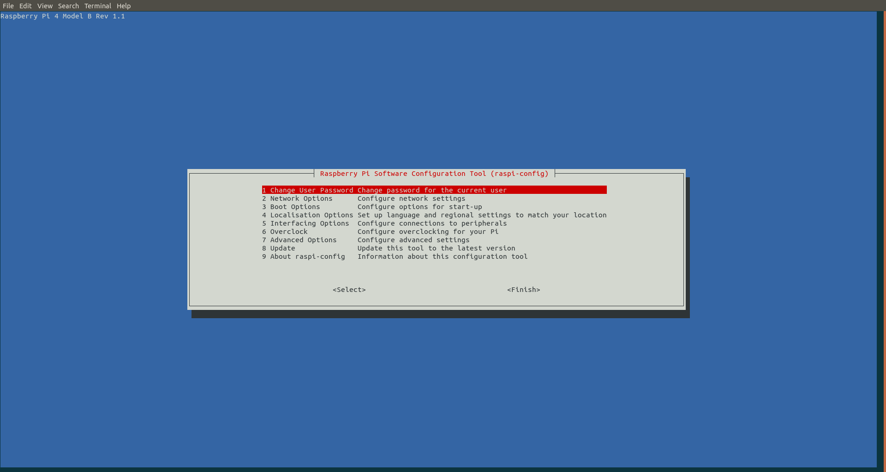
I performed the following -
- Boot Options - set to my preferance
- Expand File System
- Camera
- Update

Reboot after you are done

SSH into it again after rebooting and you are ready to play with it -
```console
$ ssh pi@192.168.0.112
pi@192.168.0.112's password: 
Linux raspberrypi 4.19.75-v7l+ #1270 SMP Tue Sep 24 18:51:41 BST 2019 armv7l

The programs included with the Debian GNU/Linux system are free software;
the exact distribution terms for each program are described in the
individual files in /usr/share/doc/*/copyright.

Debian GNU/Linux comes with ABSOLUTELY NO WARRANTY, to the extent
permitted by applicable law.
Last login: Fri Oct 25 14:13:05 2019
pi@raspberrypi:~ $
```
## Optional Checks
- Check what programs are installed using - `apt list --installed`

- Check if Python interpreter runs -
    ```console
    pi@raspberrypi:~ $ python3
    Python 3.7.3 (default, Apr  3 2019, 05:39:12) 
    [GCC 8.2.0] on linux
    Type "help", "copyright", "credits" or "license" for more information.
    >>> help('modules') # for getting a list of modules already present
    >>> exit()
    ```
- For Python 2 -
    ```console
    pi@raspberrypi:~ $ python
    Python 2.7.16 (default, Apr  6 2019, 01:42:57) 
    [GCC 8.2.0] on linux2
    Type "help", "copyright", "credits" or "license" for more information.
    >>> exit()
    ```

## Getting Ready with Python and [bluepy](https://github.com/IanHarvey/bluepy)
Now we won't be able to install any new python library as we don't have python's package manager - _pip_. So we will install it first.  
Run the following in order -
1. `sudo apt update`
    - `apt list --upgradable` # optional
2. `sudo apt upgrade`
3. `sudo apt install python3-pip`

For [bluepy installation](https://github.com/IanHarvey/bluepy#installation) we need `libglib2.0-dev`
- `sudo apt install libglib2.0-dev`

Install _bluepy_ -
- `python3 -m pip install bluepy`

Finally let's install _Git_ too-
- `sudo apt install git`

# VSCode Remote Server Setup
We need to setup passwordless access in order to setup the remote VSCode development environment on our R-Pi.
## Passwordless SSH
This is taken from the great documentation on [passwordless remote access](https://www.raspberrypi.org/documentation/remote-access/ssh/passwordless.md
) by the raspberry-pi team itself.  
Read that or just follow along -

**On your PC**, check if you have created SSH Keys -
```console
$ ls ~/.ssh
known_hosts
```
If you don't see `id_rsa.pub` or `id_dsa.pub` it means you haven't. So create a new key (still on your PC) now using `ssh-keygen` -  
I pressed Enter for the two prompts that follow.
```console
$ ssh-keygen
Generating public/private rsa key pair.
Enter file in which to save the key (/home/<username>/.ssh/id_rsa): 
Enter passphrase (empty for no passphrase): 
Enter same passphrase again: 
Your identification has been saved in /home/<username>/.ssh/id_rsa.
Your public key has been saved in /home/<username>/.ssh/id_rsa.pub.
The key fingerprint is:
SHA256:azbFoUF1qv+vIIX9SvuPvOPLVM6AMklyuc/yK9Yo2Xs ---@---
The key's randomart image is:
+---[RSA 2048]----+
|        ... .    |
|       . . o     |
|      . = o      |
|       + X o     |
|        S * . .  |
|         X . =   |
|       oBo* o o  |
|      oo=*EO..   |
|       o.+=+@Bo  |
+----[SHA256]-----+
```
Right now inside the `.ssh` hidden folder in R-Pi there would be nothing -
```console
pi@raspberrypi:~/.ssh $ ls
pi@raspberrypi:~/.ssh $
```
We now need to copy the public key on our PC to our R-Pi using `ssh-copy-id pi@<pi's ip address>` command -
```console
$ ssh-copy-id pi@192.168.0.112
/usr/bin/ssh-copy-id: INFO: attempting to log in with the new key(s), to filter out any that are already installed
/usr/bin/ssh-copy-id: INFO: 1 key(s) remain to be installed -- if you are prompted now it is to install the new keys
pi@192.168.0.112's password: 

Number of key(s) added: 1
```
Now try logging into R-Pi, with just - `ssh 'pi@<your pi's ip address>'` (no password) and check to make sure that only the key(s) you wanted were added.

```console
$ ssh 'pi@192.168.0.112'
Linux raspberrypi 4.19.75-v7l+ #1270 SMP Tue Sep 24 18:51:41 BST 2019 armv7l

The programs included with the Debian GNU/Linux system are free software;
the exact distribution terms for each program are described in the
individual files in /usr/share/doc/*/copyright.

Debian GNU/Linux comes with ABSOLUTELY NO WARRANTY, to the extent
permitted by applicable law.
Last login: Fri Oct 25 14:15:43 2019 from 192.168.0.109
pi@raspberrypi:~ $ ls
pi@raspberrypi:~ $ exit
logout
Connection to 192.168.0.112 closed.
```
Yes We Can! So the login process was a success.  

**We will now just check if the key is the same** -
- Key on PC
    ```console
    $ cat ~/.ssh/id_rsa.pub
    ssh-rsa AAAAB3NzaC1yc2EAAAADAQABAAABAQDPvc2uuUf7IS4h3d/7qvj7WxZJfb/xqqiolIbb8tUe9EHTc+0xWjzAEOTKw1cP9zkr8LvqikDu3ZZR2RV6dcehrxt6ux4rhRQSeD/KchnEaqudPgi99cp8nujo/MFt9dhgA1AzXV/eZbPk087u9/TnQc8C7lB3vphxU2g6fGYvCVoF6C+8J+Jb4WdqER2e8gLUeTtm0PBFw8yYjK5y3Cz40WIOv4Gv/XJLIs2ah/NwbXrLcK0zEIYNQXPWqrAc29EURSjZ4/0pEw3Ts7HXBG4HzMBximEX+5vmyo+8lZgzSmO0EMFR/Wd5nuNmEMtDn8ZrEEZt0TKY0HK3B72+lk0N ---@---
    ```
- Lets compare the above to what R-Pi received -  
    As mentioned above the `.ssh` folder was empty before. But now it will have our key -
    ```console
    pi@raspberrypi:~/.ssh $ ls
    authorized_keys
    ```
    Lets `cat` the authorized keys -
    ```console
    pi@raspberrypi:~/.ssh $ cat authorized_keys 
    ssh-rsa AAAAB3NzaC1yc2EAAAADAQABAAABAQDPvc2uuUf7IS4h3d/7qvj7WxZJfb/xqqiolIbb8tUe9EHTc+0xWjzAEOTKw1cP9zkr8LvqikDu3ZZR2RV6dcehrxt6ux4rhRQSeD/KchnEaqudPgi99cp8nujo/MFt9dhgA1AzXV/eZbPk087u9/TnQc8C7lB3vphxU2g6fGYvCVoF6C+8J+Jb4WdqER2e8gLUeTtm0PBFw8yYjK5y3Cz40WIOv4Gv/XJLIs2ah/NwbXrLcK0zEIYNQXPWqrAc29EURSjZ4/0pEw3Ts7HXBG4HzMBximEX+5vmyo+8lZgzSmO0EMFR/Wd5nuNmEMtDn8ZrEEZt0TKY0HK3B72+lk0N ---@---
    pi@raspberrypi:~/.ssh $
    ```
As we can compare, both are same.

## Remote Development
[They say](https://twitter.com/joaomoreno/status/1138379435839754240) to use [VS Code Insiders Edition](https://code.visualstudio.com/insiders/), but as of Oct 25, 2019, it seems to work just fine with the Stable version so you don't have to install the Insiders Edition on your PC. Yay !  
They also say that you have to use the [Nightly version](https://marketplace.visualstudio.com/items?itemName=ms-vscode-remote.remote-ssh-nightly) of the [Remote SSH](https://marketplace.visualstudio.com/items?itemName=ms-vscode-remote.remote-ssh) Extension, but for me the stable verisons worked just fine. I will show both the ways just for the sake of completeness -

Using Stable Versions
---------------------
Install the [Remote Development](https://marketplace.visualstudio.com/items?itemName=ms-vscode-remote.vscode-remote-extensionpack) Extension and it will install all the necessary components for you. Do it the from the GUI or follow the steps below -
- `CTRL+P` to open the *Command Palette* and paste the folowing -
- `ext install ms-vscode-remote.vscode-remote-extensionpack`

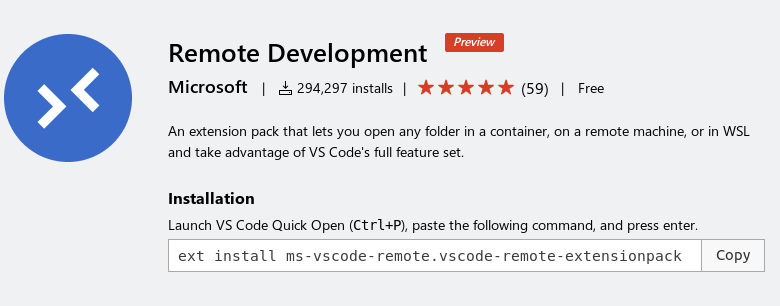

Using Nightly Remote SSH Version
--------------------------------
1. Install the Remote Development Extension as shown above. 
2. **Remove** the [Remote -SSH Extension](https://marketplace.visualstudio.com/items?itemName=ms-vscode-remote.remote-ssh), apparently **Disabling** it doesn't work. 
3. In it's place install the Nightly Remote SSH Extension.

| Stable | Nightly |
| :---: | :---: |
| 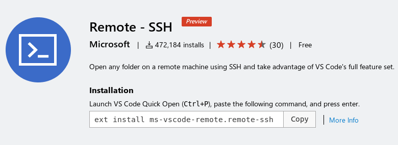 | 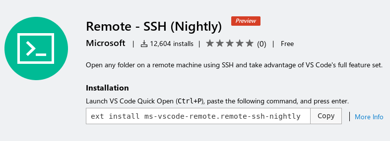 |

<!-- I never had it installed so I just had to install the **Nightly** version.  
 -->

Once its done, your VSCode would look different - at the **bottom left corner** -  


Setting up Remote development on R-Pi
-------------------------------------
Setting up server components on R-Pi -
- Click on the *facing arrows* and select `Remote-SSH: Connect to Host...` from the dropdown
- Enter `pi@<your pi's ip-address>` and press enter
- A new VSCode window will open with R-Pi's folders, extensions....basically your R-Pi VSCode dev environment. Wait for a while as it will install the VS Code Server components on your R-Pi. 

While it's installing it will look like the following -  
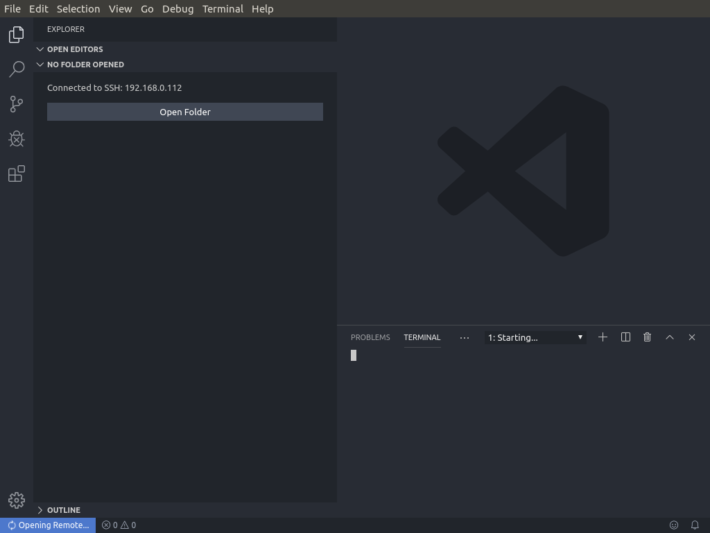

After it installs it will look like this-  
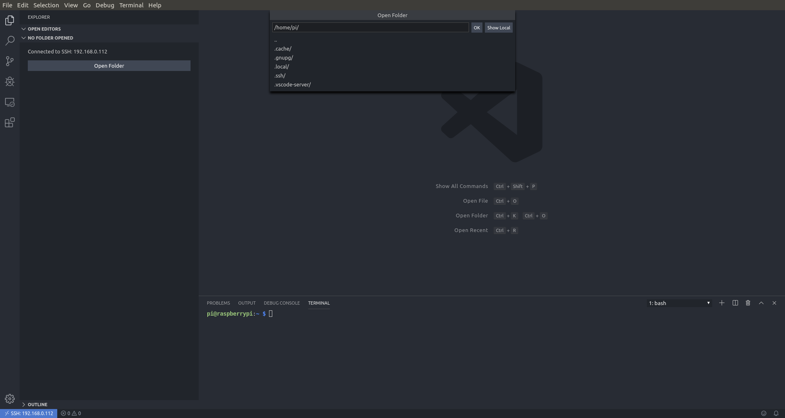

You can check that the folders you see are those on the R-Pi by clicking on *File* -> *Open Folder*.  
Moreover you will see the raspberry-pi prompt in VSCode's integrated terminal -
```console
pi@raspberrypi:~ $
```

Now you will have to install the extensions *Python*, *Arduino*, etc.  
We will do this the regular way - click on Extension icon and type whatever extension you want to install, then just click on the green `Install in SSH: <your R-Pi IP>` button below the extension name to install the extension in your R-Pi environment.  
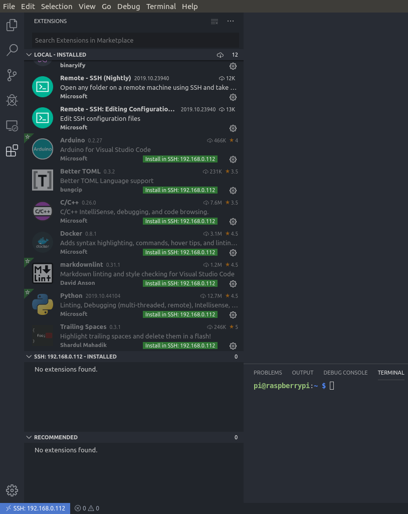

OR  
do it the pro way using the command paletee as I had shown above.

# Bluetooth development with Python
1. From your VSCode Terminal at the bottom make a new folder -
    - `mkdir bluetooth-tests`
2. Copy the code [here](https://github.com/armsp/nano-33-ble-gen/blob/master/bluetooth/python_bluetooth/bluetooth_peripheral.py) (you will need Arduino Nano 33 BLE with [this](https://github.com/armsp/nano-33-ble-gen/tree/master/bluetooth/real_time_plotting/accelerometer_xyz_plotting) firmware) to your editor or write your own and save it inside the folder you made (Just press CTRL+S and follow the prompts, its self explanatory)
3. From your VSCode Terminal Execute the python code 
    - `cd bluetooth-tests`
    - `python3 your_file_name.py`
4. Voila !
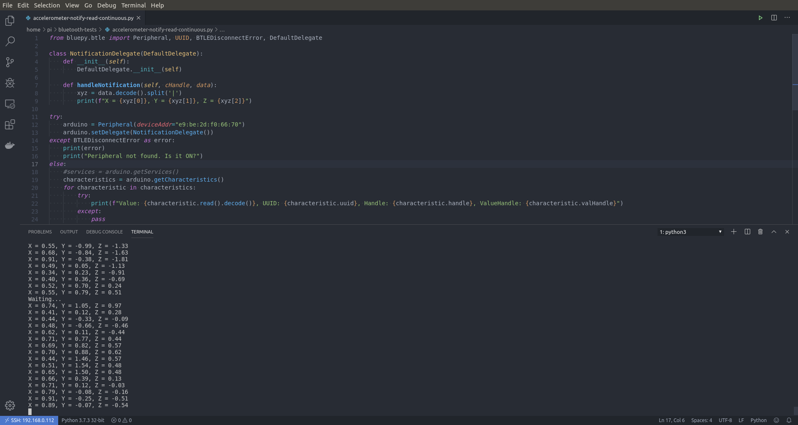

# [Link to install Docker](./r-pi-docker.html)

# The END
Shutdown your R-Pi -  `sudo shutdown -h now`
